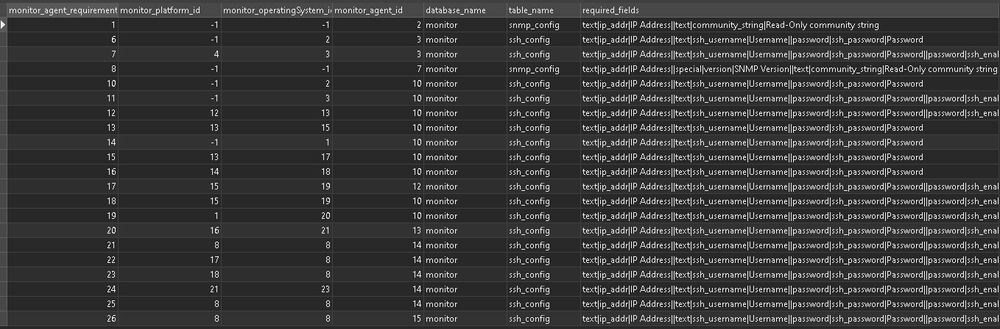

# New Agent - Monitor Structure

- `Monitor Agent` in this case `Server-side SSH agent`


- `monitor_agent_identifier` specifies what is necessary to identify the agent, in this case it


- `monitor_agent_requirements` This table references the information necessary got the system to recognize and use an agent


- `monitor_sysinfo_linking` This table is referenced in `/admin/settings/checktypes.php` (The file responsible for creating the admin view of the monitoring structures)

I made copies of the following DB tables to my Local PC:

- `DB` tables to my local PC, the reason for that is:

- I want to add `foreign key constraints` to `monitor_structure` table and some other tables. This is not to push to production but to speed up `dev`. If the `foreign key constraints` are setup then it is a lot easier and safer to build your `monitor structure` because the database will auto reference the tables that are constraining it so that you can see the `reference name` of the `id's` next to them.

I'm saving all the `alter table statements` for the `foreign key setup` separate from the `migrations` that will have to be run for the module.

Only when the `dev tools` are referenced on the dev server does the system add the following
An extra button if you are on a dev sever. This button lets you clone a monitor structure tree. You can choose what parts of the tree you want to clone and it will give you a list of sql migrations with a checkbox next to each one, when you have made your selection you can click on export and get you migration that's ready to add to the patch. the SQL queries for the migration as well.

## My reasoning for doing it this way

- No one will ever have to figure out how these structures all fit together.
- No more mistakes can be made when building a new structure where references are made to non-existent data
- The migrations are also dynamic how where if a record are added and a reference to that record is added the id's are not pre-determined. So if one clients do have some extra records to extra systems that is not the same as the rest, we would not have to do anything different for that client. We can just trust the dB to add the references as it is setup.
- This auto referencing is not because of the foreign keys but because of storage engine that we can update from MyISAM to innoDB. This does not have to be a database wide update, but it can be done per table. There is also nothing MyISAM can do that InnoDB does not support so it is not a breakable change so it is safe to run. It will however lock the table for the time it takes to run the engine update, but it will be for less than 10 seconds.
- At th moment the follow fields need to be referenced manually to add the tree, I can guarantee that a most of the keys that could not not be created was because of reference mistakes.
  - monitor.`mib`.mib_id`
  - monitor.`mib_lookup`.mib_lookup_id`
  - monitor.`monitor_agent`.monitor_agent_id`
  - monitor.`monitor_agent_identifier`.monitor_agent_identifier_id`
  - monitor.`monitor_agent_requirements`.monitor_agent_requirements_id`
  - monitor.`monitor_agentcode_linking`.monitor_agentcode_linking_id`
  - monitor.`monitor_application`.monitor_application_id`
  - monitor.`monitor_backup`.monitor_backup_id`
  - monitor.`monitor_backup_linking`.monitor_backup_linking_id`
  - monitor.`monitor_category`.monitor_category_id`
  - monitor.`monitor_checktype_default`.monitor_checktype_default_id`
  - monitor.`monitor_checktype_linking`.monitor_checktype_linking_id`
  - monitor.`monitor_mib_linking`.monitor_mib_linking_id`
  - monitor.`monitor_operatingsystem`.monitor_operatingsystem_id`
  - monitor.`monitor_platform`.monitor_platform_id`
  - monitor.`monitor_setting`.monitor_setting_id`
  - monitor.`monitor_stats_linking`.monitor_stats_linking_id`
  - monitor.`monitor_structure`.monitor_structure_id`
  - monitor.`monitor_subcategory`.monitor_subcategory_id`
  - monitor.`monitor_sysinfo_linking`.monitor_sysinfo_linking_id`

So from now on building the monitor structure trees could take just a few minutes even if you're not cloning structure, the foreign keys matching the referenced tables makes this a simple excursive instead of tedious referencing back and forth.

When I was adding key constraints to the tables some of them could not be applied because some of the ID's were pointing to records that does not exist any more. I don't know if this was intentional but I believe not.

I am not adding the foreign keys to the migration because that might cause unexpected results, but they are def worth having for setting up things like this in the dev environment

The table structure and naming conventions are mostly logical but in come cases it takes a while to figure out which columns reference which other columns in which other tables.
After the contains have been done then it is also possible to a query called a "logical join" so instead of saying "left" or "right" or "inner" you can say "logical join". The tables with the constraints with will all be inner joined automatically

If there are a one to many relationship in the tables you can ask PHP PDO to auto transpose the data so that every sub matching if does not add another row to your results but actually create an object for each that gets attached to the row object for each row.

I also noticed that the DB tables are all set to MyISAM. This storage engine does not support transactions, foreign keys, safe mode, recovery mode and most kinds redundancy. The recommended storage engine is innoDB  that will make the system lot faster, more recoverable in case of disaster, foreign key checks can be used.

## Some Other Migrations

The following query can be run to output a migration that can be run to migrate all the tables to InnoDB if that is some

```sql
SET @DATABASE_NAME = 'monitor';

SELECT  CONCAT('ALTER TABLE `', table_name, '` ENGINE=InnoDB;') AS `sql_statements`
FROM    `information_schema`.`tables` AS `tb`
WHERE   `table_schema` = @DATABASE_NAME
AND     `ENGINE` = 'MyISAM'
AND     `TABLE_TYPE` = 'BASE TABLE'
ORDER BY `table_name` DESC;
```

The query above will output the following

```sql
ALTER TABLE `underinvestigation_categories` ENGINE=InnoDB;
ALTER TABLE `underinvestigation` ENGINE=InnoDB;
ALTER TABLE `treestatetype` ENGINE=InnoDB;
ALTER TABLE `treestatelatestblock` ENGINE=InnoDB;
ALTER TABLE `treestate` ENGINE=InnoDB;
ALTER TABLE `time_sync` ENGINE=InnoDB;
ALTER TABLE `time_period_type` ENGINE=InnoDB;
ALTER TABLE `time_period_config` ENGINE=InnoDB;
ALTER TABLE `test_type` ENGINE=InnoDB;
ALTER TABLE `template_config` ENGINE=InnoDB;
ALTER TABLE `template_attribute_config` ENGINE=InnoDB;
ALTER TABLE `system_template` ENGINE=InnoDB;
ALTER TABLE `system_os_application_link` ENGINE=InnoDB;
ALTER TABLE `system_os` ENGINE=InnoDB;
ALTER TABLE `system_data_category` ENGINE=InnoDB;
ALTER TABLE `system_application_tests` ENGINE=InnoDB;
ALTER TABLE `system_application` ENGINE=InnoDB;
ALTER TABLE `ssh_temp` ENGINE=InnoDB;
ALTER TABLE `ssh_config` ENGINE=InnoDB;
ALTER TABLE `snmp_temp` ENGINE=InnoDB;
ALTER TABLE `snmp_config` ENGINE=InnoDB;
ALTER TABLE `servertype` ENGINE=InnoDB;
ALTER TABLE `rrd_manager` ENGINE=InnoDB;
ALTER TABLE `report_type_settings_type` ENGINE=InnoDB;
ALTER TABLE `report_type_settings_custom` ENGINE=InnoDB;
ALTER TABLE `report_type_settings` ENGINE=InnoDB;
ALTER TABLE `report_type` ENGINE=InnoDB;
ALTER TABLE `report_template` ENGINE=InnoDB;
ALTER TABLE `report_section_settings` ENGINE=InnoDB;
ALTER TABLE `report_section_linking_settings` ENGINE=InnoDB;
ALTER TABLE `report_section_linking` ENGINE=InnoDB;
ALTER TABLE `report_section_configuration_settings` ENGINE=InnoDB;
ALTER TABLE `report_section_configuration` ENGINE=InnoDB;
ALTER TABLE `report_section` ENGINE=InnoDB;
ALTER TABLE `report_node_linking` ENGINE=InnoDB;
ALTER TABLE `report_format` ENGINE=InnoDB;
ALTER TABLE `remote_db_config` ENGINE=InnoDB;
ALTER TABLE `remotepulse` ENGINE=InnoDB;
ALTER TABLE `remotemenutree` ENGINE=InnoDB;
ALTER TABLE `queueing` ENGINE=InnoDB;
ALTER TABLE `public_holidays` ENGINE=InnoDB;
ALTER TABLE `old_ssh_data` ENGINE=InnoDB;
ALTER TABLE `old_snmp_data` ENGINE=InnoDB;
ALTER TABLE `old_log_counts` ENGINE=InnoDB;
ALTER TABLE `old_individual_cpu` ENGINE=InnoDB;
ALTER TABLE `old_if_drop` ENGINE=InnoDB;
ALTER TABLE `old_if` ENGINE=InnoDB;
ALTER TABLE `old_cpu` ENGINE=InnoDB;
ALTER TABLE `notification_templates` ENGINE=InnoDB;
ALTER TABLE `msp` ENGINE=InnoDB;
ALTER TABLE `monitor_sysinfo_linking` ENGINE=InnoDB;
ALTER TABLE `monitor_subcategory` ENGINE=InnoDB;
ALTER TABLE `monitor_stats_linking` ENGINE=InnoDB;
ALTER TABLE `monitor_setting` ENGINE=InnoDB;
ALTER TABLE `monitor_platform` ENGINE=InnoDB;
ALTER TABLE `monitor_mib_linking` ENGINE=InnoDB;
ALTER TABLE `monitor_checktype_linking` ENGINE=InnoDB;
ALTER TABLE `monitor_checktype_default` ENGINE=InnoDB;
ALTER TABLE `monitor_category` ENGINE=InnoDB;
ALTER TABLE `monitor_backup_linking` ENGINE=InnoDB;
ALTER TABLE `monitor_backup` ENGINE=InnoDB;
ALTER TABLE `monitor_application` ENGINE=InnoDB;
ALTER TABLE `monitor_agent_requirements` ENGINE=InnoDB;
ALTER TABLE `monitor_agent_identifier` ENGINE=InnoDB;
ALTER TABLE `monitor_agentcode_linking` ENGINE=InnoDB;
ALTER TABLE `monitor_agent` ENGINE=InnoDB;
ALTER TABLE `mib_lookup` ENGINE=InnoDB;
ALTER TABLE `mib` ENGINE=InnoDB;
ALTER TABLE `menu_level_type` ENGINE=InnoDB;
ALTER TABLE `menu_level_option` ENGINE=InnoDB;
ALTER TABLE `menutreestatetype` ENGINE=InnoDB;
ALTER TABLE `menutreestate` ENGINE=InnoDB;
ALTER TABLE `menutree` ENGINE=InnoDB;
ALTER TABLE `logtype` ENGINE=InnoDB;
ALTER TABLE `logimage` ENGINE=InnoDB;
ALTER TABLE `logcategory` ENGINE=InnoDB;
ALTER TABLE `logaction` ENGINE=InnoDB;
ALTER TABLE `log` ENGINE=InnoDB;
ALTER TABLE `latest_data` ENGINE=InnoDB;
ALTER TABLE `hostname` ENGINE=InnoDB;
ALTER TABLE `global_backup_period` ENGINE=InnoDB;
ALTER TABLE `file_download` ENGINE=InnoDB;
ALTER TABLE `eventtype` ENGINE=InnoDB;
ALTER TABLE `eventreferencetype` ENGINE=InnoDB;
ALTER TABLE `eventreference` ENGINE=InnoDB;
ALTER TABLE `eventdata` ENGINE=InnoDB;
ALTER TABLE `event` ENGINE=InnoDB;
ALTER TABLE `enviro_latest_data` ENGINE=InnoDB;
ALTER TABLE `environment` ENGINE=InnoDB;
ALTER TABLE `datasourcevalue` ENGINE=InnoDB;
ALTER TABLE `datasourcetype` ENGINE=InnoDB;
ALTER TABLE `datasourceentitytype` ENGINE=InnoDB;
ALTER TABLE `datasourceentity` ENGINE=InnoDB;
ALTER TABLE `datasourceattribute` ENGINE=InnoDB;
ALTER TABLE `datasource` ENGINE=InnoDB;
ALTER TABLE `dashboard_slide` ENGINE=InnoDB;
ALTER TABLE `dashboard` ENGINE=InnoDB;
ALTER TABLE `custom_addsystemwizard` ENGINE=InnoDB;
ALTER TABLE `check_gather_type` ENGINE=InnoDB;
ALTER TABLE `check_additional_data` ENGINE=InnoDB;
ALTER TABLE `checktype` ENGINE=InnoDB;
ALTER TABLE `checks_sysinfo` ENGINE=InnoDB;
ALTER TABLE `checks_simple` ENGINE=InnoDB;
ALTER TABLE `checks_remote` ENGINE=InnoDB;
ALTER TABLE `checks_complex` ENGINE=InnoDB;
ALTER TABLE `application_os_monitored_attributes` ENGINE=InnoDB;
ALTER TABLE `agent_data_update` ENGINE=InnoDB;
ALTER TABLE `agent_data` ENGINE=InnoDB;
```

## Views to Navigate the Data

```sql

/* Query for dev environment to give you a `monitor_agentcode_linking` table with the values next to the id's */

SELECT
    `monitor_agentcode_linking`.monitor_agent_id,
    `monitor_agent`.`name` 
        AS monitor_agent_name,
    `monitor_agentcode_linking`.monitor_operatingSystem_id, 
    `monitor_operatingsystem`.`name` 
        AS monitor_operatingsystem_name, 
    `monitor_agentcode_linking`.monitor_platform_id, 
    `monitor_platform`.`name` 
        AS monitor_platform_name, 
    `monitor_agentcode_linking`.monitor_application_id, 
    `monitor_application`.`name`     
        AS monitor_application_name,
    `monitor_agentcode_linking`.`agentCode` 
        AS agent_code
FROM
    monitor_agentcode_linking
    LEFT JOIN
    monitor_platform
    ON 
        monitor_agentcode_linking.monitor_platform_id = monitor_platform.monitor_platform_id
    LEFT JOIN
    monitor_operatingsystem
    ON 
        monitor_agentcode_linking.monitor_operatingSystem_id = monitor_operatingsystem.monitor_operatingSystem_id
    LEFT JOIN
    monitor_application
    ON 
        monitor_agentcode_linking.monitor_application_id = monitor_application.monitor_application_id
    LEFT JOIN
    monitor_agent
    ON 
        monitor_agentcode_linking.monitor_agent_id = monitor_agent.monitor_agent_id

```

## Migrations

Create types table to match the type_id in the monitor_structure table

```sql
SET NAMES utf8;
SET FOREIGN_KEY_CHECKS = 0;

-- ----------------------------
-- Table structure for types
-- ----------------------------
DROP TABLE IF EXISTS `types`;
CREATE TABLE `types`  (
  `type_id` int(11) NOT NULL AUTO_INCREMENT,
  `name` varchar(100) CHARACTER SET latin1 COLLATE latin1_swedish_ci NULL DEFAULT NULL,
  PRIMARY KEY (`type_id`) USING BTREE
) ENGINE = MyISAM AUTO_INCREMENT = 5 CHARACTER SET = latin1 COLLATE = latin1_swedish_ci ROW_FORMAT = Dynamic;

-- ----------------------------
-- Records of types
-- ----------------------------
INSERT INTO `types` VALUES (1, 'platforms');
INSERT INTO `types` VALUES (2, 'operatingSystems');
INSERT INTO `types` VALUES (3, 'applications');
INSERT INTO `types` VALUES (4, 'agents');

SET FOREIGN_KEY_CHECKS = 1;
```
