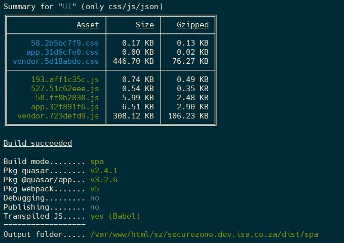
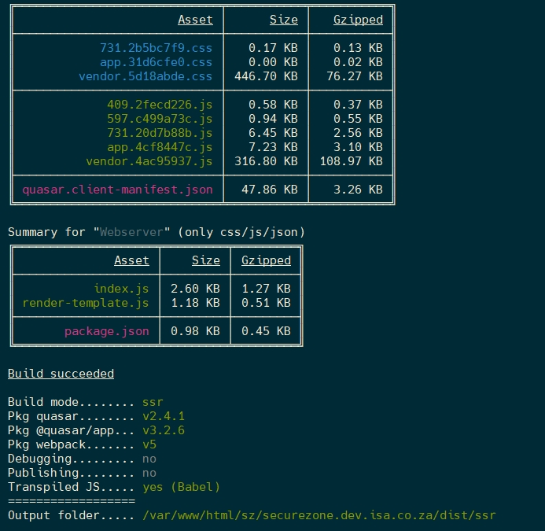
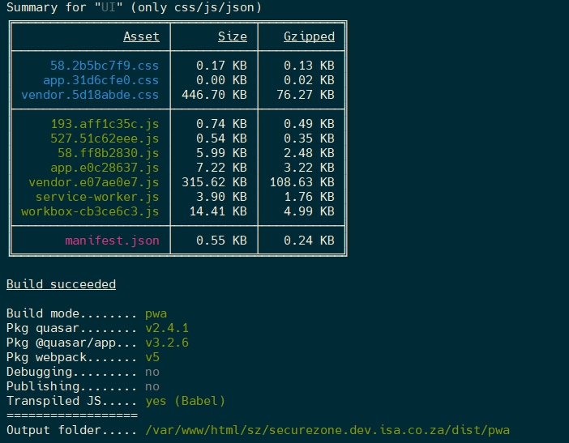

# Quasar Build

## Development

```shell
# run development server (with default theme)
$ quasar dev

# on specific port
$ quasar dev -p 9090

# SSR
$ quasar dev -m ssr

# PWA
$ quasar dev -m pwa

# Mobile App
$ quasar dev -m cordova -T [android|ios]
# or the shorter form:
$ quasar dev -m [android|ios]

# Electron App
$ quasar dev -m electron

# passing extra parameters and/or options to
# underlying "cordova" or "electron" executables:
$ quasar dev -m ios -- some params --and options --here
$ quasar dev -m electron -- --no-sandbox --disable-setuid-sandbox
# when on Windows and using Powershell:
$ quasar dev -m ios '--' some params --and options --here
$ quasar dev -m electron '--' --no-sandbox --disable-setuid-sandbox
```

## Production

Build assets for production.

```shell
# build for production
$ quasar build

# SSR
$ quasar build -m ssr

# PWA
$ quasar build -m pwa

# Mobile App
$ quasar build -m cordova -T [android|ios]
# or the short form:
$ quasar build -m [android|ios]

# passing extra parameters and/or options to
# underlying "cordova" executable:
$ quasar build -m ios -- some params --and options --here
# when on Windows and using Powershell:
$ quasar build -m ios '--' some params --and options --here

# Electron App
$ quasar build -m electron
```

## Production Builds Done

### Secure Zone SPA (Single Page Application)

This is called Single Page App not because it really only has one page but because loads one initial page and from then on the content or only parts of the content inside the page get replaced, making it a lot faster and less to load.

- Location: /var/www/html/sz/securezone.dev.isa.co.za
- Command: `quasar build`
- Output Location: /var/www/html/sz/securezone.dev.isa.co.za/dist/spa
- View Result: <http://securezone.dev.isa.co.za>



### Secure Zone SSR (Server Side Rendering)

This is good to make the initial page rendering faster and for when Web Spiders like google want to index your page, web spiders or crawlers don't have to intelligence to run Javascript code and then to wait for the result and then to index those results, it only knows how to go to a url and then to read the result, so what I recommend is that you detect the user agent (Device or Browser or Spider) accessing the website and according to what you detect you either open the SSR version or the SPA version

- Location: /var/www/html/sz/securezone.dev.isa.co.za
- Command: `quasar build -m ssr`
- Output Location: /var/www/html/sz/securezone.dev.isa.co.za/dist/spa
- View Result: <http://ssr.securezone.dev.isa.co.za>



### Secure Zone PWA (Progressive Web App)

The PWA and SPA are very much alike in almost all ways but a PWA does something very cool. When you open the website for the the first time it will ask you if you want to install the website as an app. If you select 'yes' it will add an icon to the home screen of your device and you will even be able to access the pages offline depending on how many pages there are and what you have accessed while being online and what the developer said is the "Must have" pages offline up 100mb. At the moment the entire site is only 2.5MB and less than 1MB zipped (The way it is saved on the device). Of course pages that need dynamic data like reports and whatever usually comes from the API would only be able to show what the person viewed when last online and we must be sure to show that it is the data relevant to time and date, but that can be done. If it is a system where the user input a lot of data, like create quotes or invoices or job cards etc. that can all be done offline, things like the products, clients etc. can be part of the "Must Have" data to store and when the user comes back online everything will be synced with the server. This is a very nice way to build your apps especially the offline capability

- These compilations needs some preparations to complete [Guide to App Compile](12.5-guideAppCompile.md)
- Location: /var/www/html/sz/securezone.dev.isa.co.za
- Command: `quasar build -m cordova -T android`
- Output Location: /var/www/html/sz/securezone.dev.isa.co.za/dist/pwa
- View Result: <http://pwa.securezone.dev.isa.co.za>


